# Coffee House: Creative Extension

### Anna Vasilevich

Note:
type S


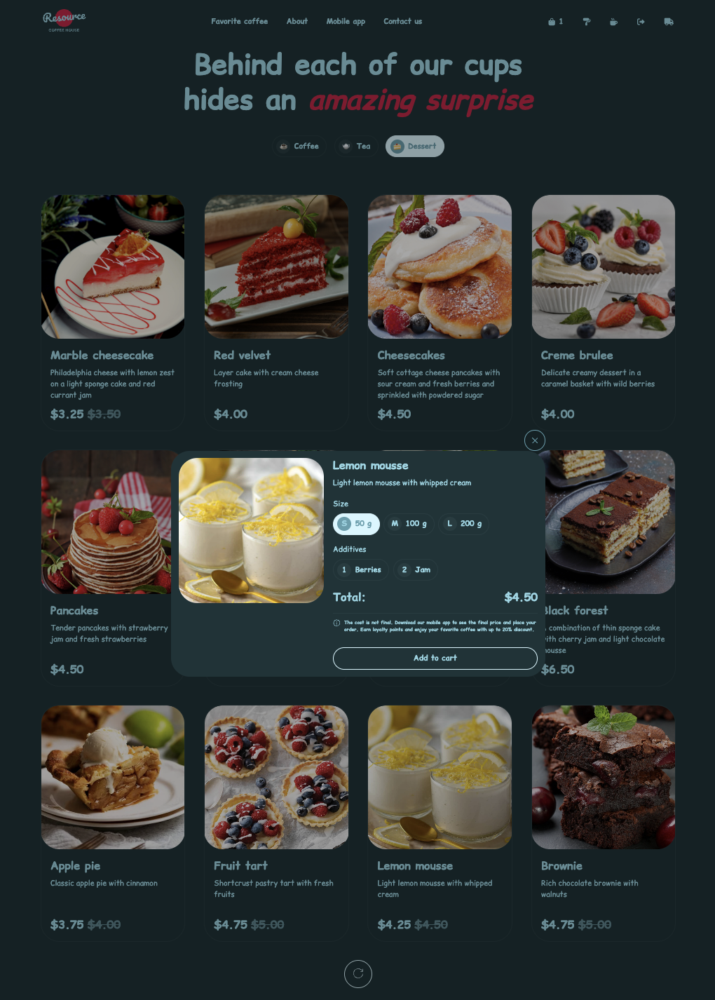


### What have I built:

- Firebase Authentication <!-- .element: class="fragment" data-fragment-index="1" -->
- Firestore user data <!-- .element: class="fragment" data-fragment-index="2" -->
- Theme switcher <!-- .element: class="fragment" data-fragment-index="3" -->
- Logout functionality <!-- .element: class="fragment" data-fragment-index="4" -->
- Firestore order submission <!-- .element: class="fragment" data-fragment-index="5" -->
- Order history page <!-- .element: class="fragment" data-fragment-index="6" -->
- Husky pre-commit checks <!-- .element: class="fragment" data-fragment-index="7" -->
- CI/CD via Netlify auto-deploy <!-- .element: class="fragment" data-fragment-index="8" -->


### Why I chose Firebase:

- I wanted to learn how real authentication works in modern apps. <!-- .element: class="fragment" data-fragment-index="1" -->
- Firebase allowed me to build full login → order → history flow. <!-- .element: class="fragment" data-fragment-index="1" -->


### Why I chose theme switcher:

- I care about UI/UX <!-- .element: class="fragment" data-fragment-index="1" -->
- I can’t live without constantly repainting buttons in the browser <!-- .element: class="fragment" data-fragment-index="1" -->


### Why I chose Husky:
- Husky helps me write cleaner code and feel more “professional”. <!-- .element: class="fragment" data-fragment-index="1" -->


### Theme Switcher (Colors + Fonts + Transitions)

- implemented smooth CSS transitions
- theme changes both color palette AND font family
- stored in localStorage
- fully responsive + accessible
- improves user experience both visually and functionally


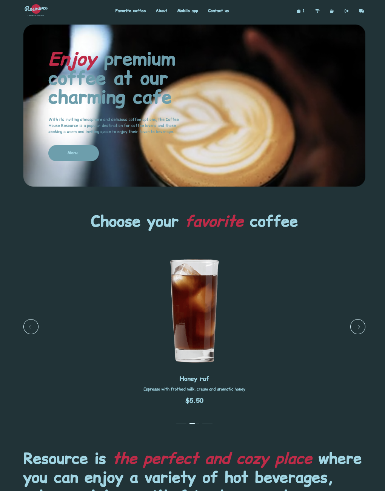
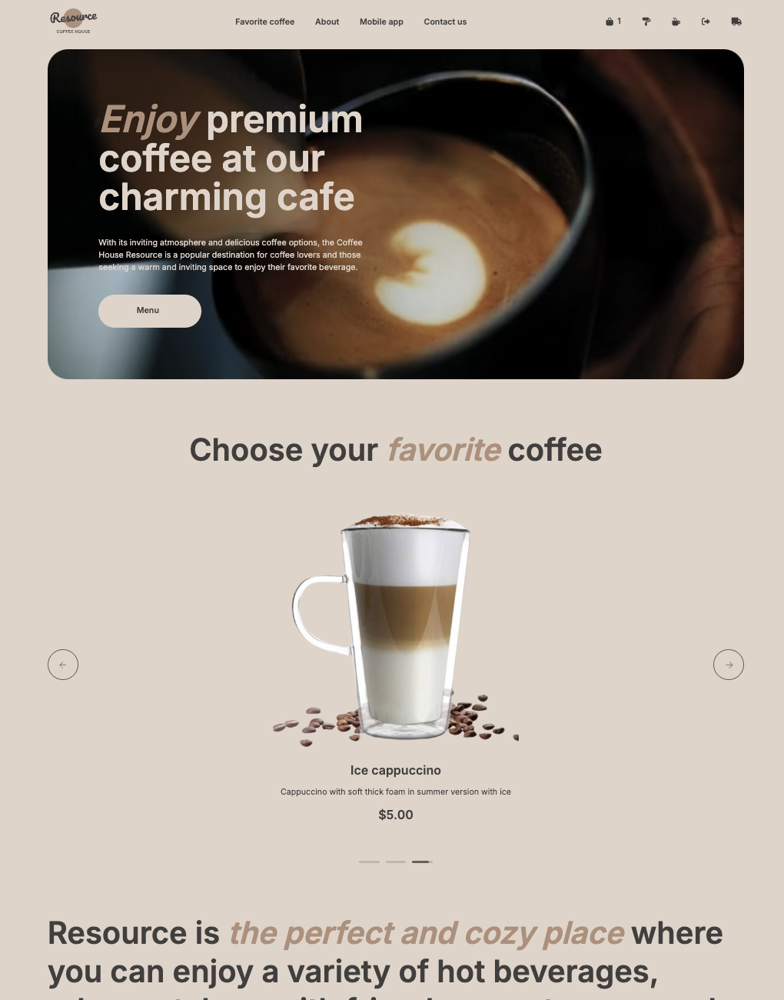


### Authentication (Firebase Auth)

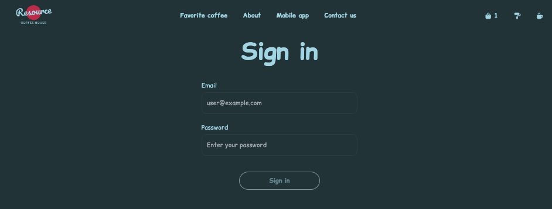
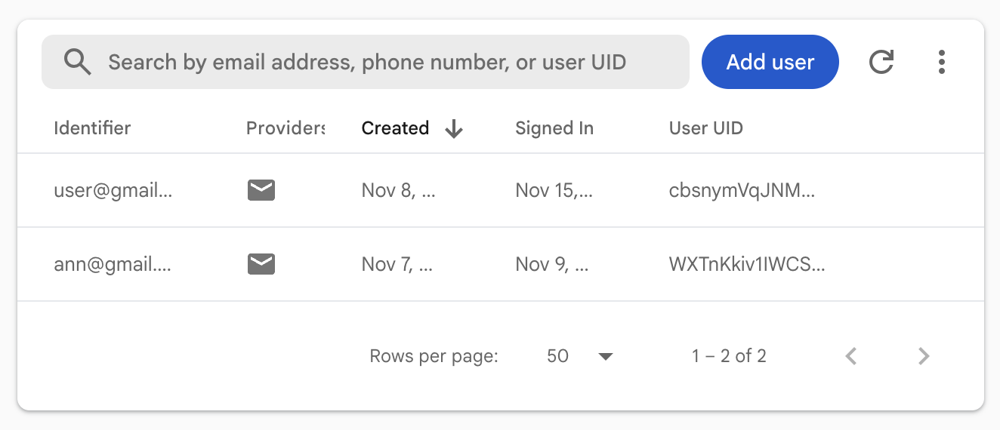

used email/password provider


### auth.ts
```
import {
  createUserWithEmailAndPassword,
  signInWithEmailAndPassword,
  signOut,
} from "firebase/auth";

export async function registerUser(email: string, password: string) {
  const userCredential = await createUserWithEmailAndPassword(
    auth,
    email,
    password
  );
  return userCredential.user;
}

export async function loginUser(email: string, password: string) {
  const userCredential = await signInWithEmailAndPassword(
    auth,
    email,
    password
  );
  return userCredential.user;
}

export async function logoutUser() {
  await signOut(auth);
}
```


onAuthStateChanged → updates UI in real time
```

onAuthStateChanged(auth, async (user) => {
  if (user) {
    const userData = await loadUserData();
...
```


### Saving User Data (Firestore)

on registration → create document in users/{uid}

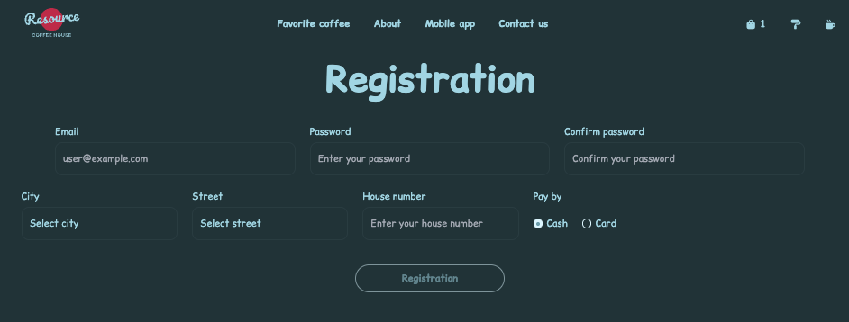
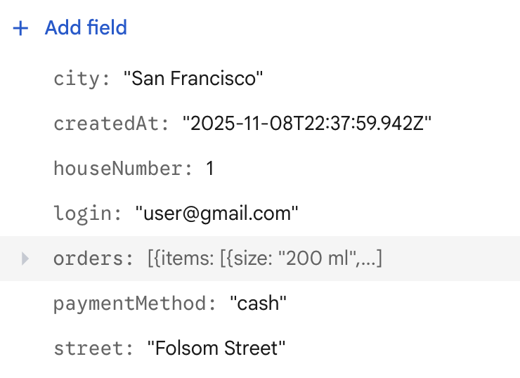

store: login(email), city, street, houseNumber, paymentMethod, createdAt


### user.ts
```
import { doc, getDoc } from "firebase/firestore";
import { auth, db } from "@/firebase";
import type { User as FirebaseUser } from "firebase/auth";

export async function loadUserData(): Promise<User | null> {
  const user: FirebaseUser | null = auth.currentUser;
  if (!user) return null;

  const docRef = doc(db, "users", user.uid);
  const docSnap = await getDoc(docRef);

  if (docSnap.exists()) {
    return docSnap.data() as User;
  } else {
    console.log("No such document!");
    return null;
  }
}
```


### Logout Button


- logot button is dynamically rendered
- one-click logout via firebase.auth().signOut()
- clears user stat


### index.ts
```
import "@/styles/style.scss";
import { loadComponent } from "./utils/loadComponent.ts";

document.addEventListener("DOMContentLoaded", async () => {
  await loadComponent("header");
  (await import("./utils/addSignOutIcon.ts")).addSignOutIcon();
  ....
});
```


### addSignOutIcon.ts
```
export function addSignOutIcon() {
  const wrapper = document.querySelector<HTMLDivElement>("#nav-right");
  if (!wrapper) return;

  onAuthStateChanged(auth, (user) => {
    if (user) {
      const singOutBtn = document.createElement("button");
      singOutBtn.classList.add("btn-icon");
      singOutBtn.type = "button";
      singOutBtn.id = "sign-out";
      singOutBtn.innerHTML = `
<i class="fa-solid fa-right-from-bracket"></i>
      `;
      singOutBtn.addEventListener("click", () => {
        logoutUser();
        clearToken();
        window.location.href = "index";
      });
      wrapper.append(singOutBtn);
    } else {
      const singOutBtn = document.querySelector<HTMLButtonElement>("#sign-out");
      singOutBtn?.remove();
    }
  });
}
```


### Cart → Firestore Order Submission

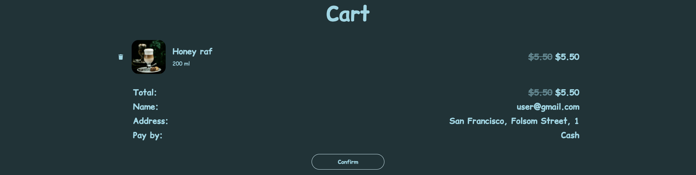

- Orders stored in client state (state + localStorage)
- On confirm → transformed into order object
- Sent to Firestore: user/{uid}/orders[]

Note:
The cart is a reactive state on the client. When the user checks out, I validate the cart and create an order document in Firestore, linking it to the user via userId. Orders include timestamps.


### cartState.ts
```
function loadFromLocalStorage(): CartState {
  const saved = localStorage.getItem(STORAGE_KEY);
  if (saved) return JSON.parse(saved);
  return { items: [], totalPriceOld: 0, totalPriceNew: 0 };
}

function saveToLocalStorage(state: CartState): void {
  localStorage.setItem(STORAGE_KEY, JSON.stringify(state));
}

let state: CartState = loadFromLocalStorage();

function recalcTotals() {
  state.totalPriceOld = state.items.reduce(
    (sum, item) => sum + item.priceOld * item.quantity,
    0,
  );
  state.totalPriceNew = state.items.reduce(
    (sum, item) => sum + item.priceNew * item.quantity,
    0,
  );
}

function addItem(newItem: CartItem) {
  const existing = state.items.find(
    (item) =>
      item.productId === newItem.productId &&
      item.size === newItem.size &&
      JSON.stringify(item.additives) === JSON.stringify(newItem.additives),
  );

  if (existing) {
    existing.quantity += newItem.quantity;
  } else {
    state.items.push(newItem);
  }

  recalcTotals();
  saveToLocalStorage(state);
}

function clear() {
  state = { items: [], totalPriceOld: 0, totalPriceNew: 0 };
  saveToLocalStorage(state);
}

function getCart(): CartItem[] {
  return state.items;
}
function setCart(items: CartItem[]): void {
  state.items = items;
  recalcTotals();
  saveToLocalStorage(state);
}

function getTotalPriceOld(): number {
  return state.totalPriceOld;
}

function getTotalPriceNew(): number {
  return state.totalPriceNew;
}

function getTotalCount(): number {
  return state.items.reduce((sum, item) => sum + item.quantity, 0);
}

export function useCartState() {
  return {
    addItem,
    clear,
    getCart,
    setCart,
    getTotalPriceOld,
    getTotalPriceNew,
    getTotalCount,
  };
}
```


### hendleConfirm.ts
```
export const handleConfim = async (order: Order) => {
  const user = auth.currentUser;
  if (!user) {
    console.error("User not authenticated");
    return;
  }

  const errorDiv: HTMLHeadingElement | null = document.querySelector("#error");
  const cartList: HTMLUListElement | null =
    document.querySelector("#cart-list");
  if (
    !(errorDiv instanceof HTMLHeadingElement) ||
    !(cartList instanceof HTMLUListElement)
  ) {
    throw new Error("Elements not found");
  }
  try {
    errorDiv.classList.add("hidden");

    const userDocRef = doc(db, "users", user.uid);

    await updateDoc(userDocRef, {
      orders: arrayUnion({
        ...order,
        createdAt: new Date().toISOString(),
      }),
    });

    clear();
    if (cartList)
      cartList.innerHTML = `<h3 id="message" class="message">
              Thank you for your order! Our manager will contact you shortly.
            </h3>`;
    if (errorDiv) errorDiv.classList.add("hidden");
    addCartIcon();
    refreshTotal();
    disabledConfirm();
  } catch (error) {
    console.error("Error saving order:", error);
    errorDiv?.classList.remove("hidden");
  }
};
```


### Order History Page (Firestore)

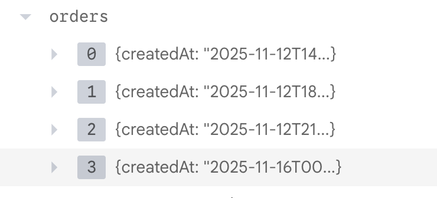
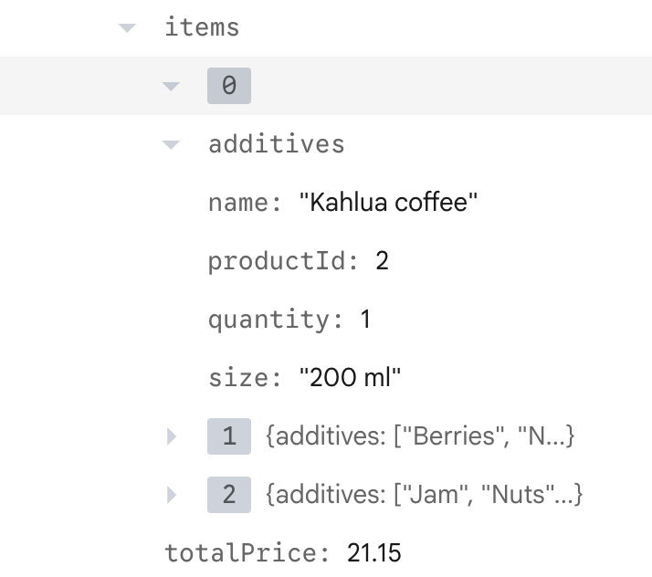

- queried Firestore for orders by current user’s ID


- displayed them in table format

Note:
queried Firestore for orders by current user’s ID
displayed them in table format
demonstrates full read/write cycle with database


### getOrders.ts
```
export const getOrders = async () => {
  onAuthStateChanged(auth, async (user) => {
    if (user) {
      const userData = await loadUserData();

      if (!userData) {
        wrapper.innerHTML = "No user data found";
        return;
      }
      const orders = userData.orders;

      if (!orders) {
        wrapper.innerHTML = "No orders found";
        return;
      }

      const header = document.createElement("thead");
      header.innerHTML = `<tr><th>#</th><th>Date</th><th>Items</th><th>Price</th></tr>`;

      const body = document.createElement("tbody");

      wrapper.append(header, body);

      orders.map((order: Order, index) => {
        const orderDiv = document.createElement("tr");
        orderDiv.innerHTML = `
          <td>${index + 1}</td>
          <td>${order.createdAt?.slice(0, 10)}</td>
          <td>${order.items
            .map((item) => {
              return `<p>${item.name} x ${item.quantity}</p>`;
            })
            .join("")}</td>
          <td>$${order.totalPrice.toFixed(2)}</td>
          `;

        body.append(orderDiv);
      });
    }
  });
};
```


### Husky Pre-Commit Hooks (Code Quality)

```
"lint-staged": {
  "*.js": [
    "npm run lint:fix",
    "npm run format:check"
  ],
  "*.{css,scss}": [
    "npm run stylelint"
  ]
}
```

Note:
ensures consistent code style
prevents committing broken code
improves maintainability
real-world developer experience


### CI/CD (Netlify)

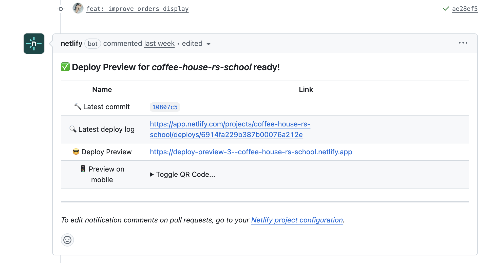

- automatic deployment on every git push
- build command runs on Netlify


### Challenges & What I Learned

- Learned how to structure Firestore collections
- Understood auth state management
- Improved UX skills (themes, transitions, responsive design)
- Gained experience with Git hooks and CI/CD
- Prepared a amazing presentation


### Conclusions

- Built a complete user journey
- Implemented backend logic
- Improved design & UX
- Professional development workflow


## 💚 Thank You! 💚

<div style="font-size: 1.1em; margin-top: 1em; text-align: center; line-height: 1.6em;">

[@dzichonka](https://github.com/dzichonka)

<p style="font-size: 0.9em; color: #888;">Done with reveal.js, Markdown and <strong>love</strong></p>

</div>

Note: That’s it! Thanks so much for your time.
If you have any questions or ideas — feel free to reach out!
I’ll be happy to connect and discuss more.
All my contacts are in the description below.
Let’s keep in touch!