# Software Development Methodologies

- Agile <!-- .element: class="fragment" data-fragment-index="1" -->
- Scrum <!-- .element: class="fragment" data-fragment-index="2" -->
- Kanban <!-- .element: class="fragment" data-fragment-index="2" -->
- Waterfall
- Planning Poker <!-- .element: class="fragment" data-fragment-index="3" -->
- Story points  <!-- .element: class="fragment" data-fragment-index="3" -->
- DevOps <!-- .element: class="fragment" data-fragment-index="3" -->
- Three-Point Estimation  <!-- .element: class="fragment" data-fragment-index="4" -->
- Expert Judgment <!-- .element: class="fragment" data-fragment-index="4" -->
...  <!-- .element: class="fragment" data-fragment-index="5" -->

## методолгия

= алгоритм по которому работает вся команда

### Классические модели
Traditional Methodology

**(Waterfall)**
- Вся работа выполняется поэтапно, строго по плану.
- Нет промежуточного результата до самого конца.

<small>

Подходит, когда:

- Требования чёткие и не меняются.
- Важно соблюдение сроков, документации, стандартов.

Пример: строительство здания</small>

### Гибкие модели
Flexible Methodology

**(Agile)**

- Проект разбивается на маленькие части — подзадачи, спринты, инкременты.

- Каждая часть — это уже рабочий результат, который можно протестировать, показать заказчику.

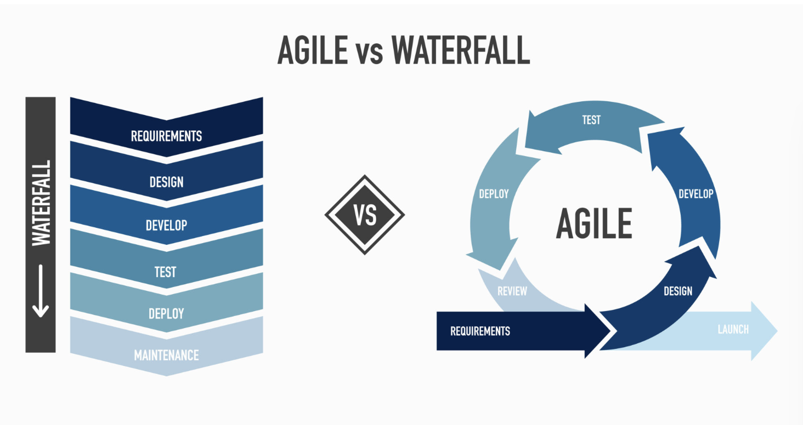

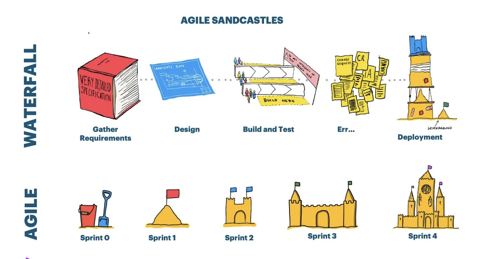

## Waterfall
(Каскадная модель)
<small>

- Последовательные фазы: Анализ → Проектирование → Реализация → Тестирование → Внедрение → Поддержка.
- Каждая стадия должна быть завершена до начала следующей.
- Изменения после старта — сложны и затратны.
- Подходит для проектов с **чёткими, стабильными требованиями**.

</small>

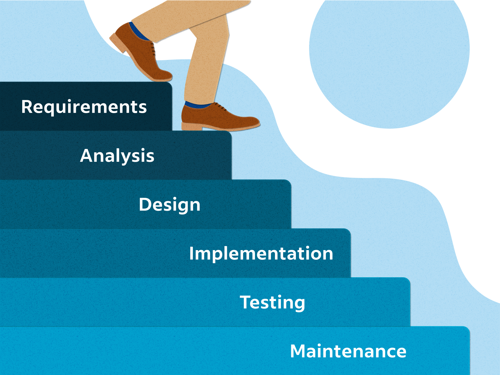
<small>Анализ → Проектирование → Реализация → Тестирование → Внедрение → Поддержка</small>

## Agile Manifesto

| Более важно                              | Менее важно                              |
|------------------------------------------|-------------------------------------------|
| **Люди и взаимодействие**                | Процессы и инструменты                    |
| **Работающий продукт**                   | Исчерпывающая документация                |
| **Сотрудничество с заказчиком**          | Согласование условий контракта           |
| **Готовность к изменениям**              | Следование первоначальному плану         |

Мы признаём ценность того, что справа, но больше ценим то, что слева.

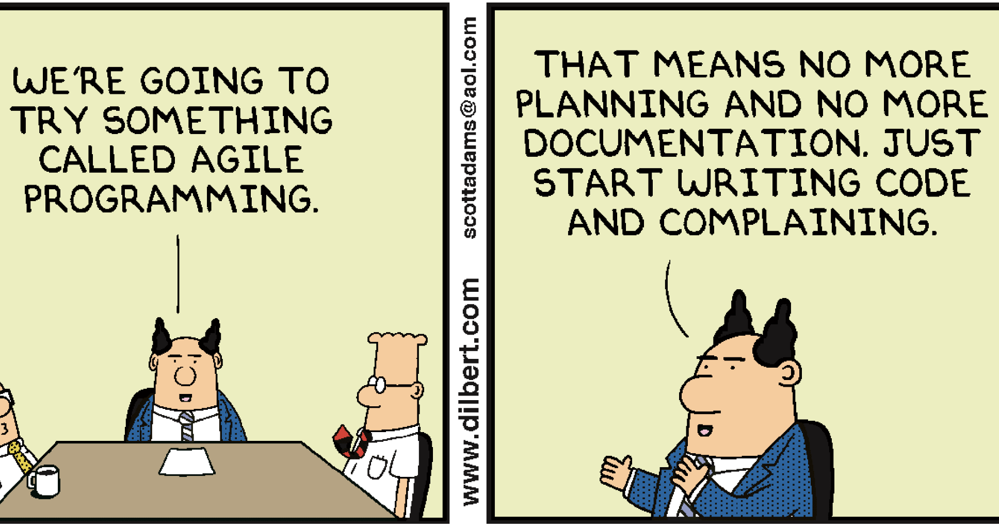

##### Agile
<small>
образ мышления, помогающий командам создавать ценные продукты в условиях неопределённости. Это не шаблон, а подход к взаимодействию.
</small>

- Мы принимаем, что финальный результат не зафиксирован.

- Мы не просто позволяем заказчику вмешиваться, мы делаем этот процесс комфортным.

- Мы всеми силами пытаемся не превратить проект в ад и хаос — даже если он идёт не по плану.

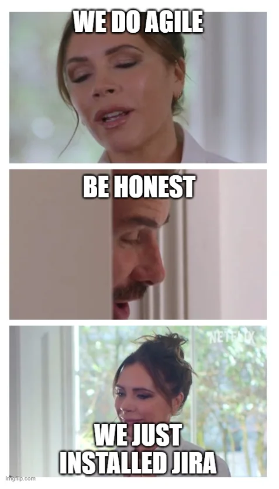

## Scrum
<small>

- Один из фреймворков Agile.
- Работа разбита на **спринты** (обычно 2 недели).
- Роли: **Scrum Master**, **Product Owner**, **Команда**.
- Артефакты: **бэклог продукта**, **бэклог спринта**, **инкремент**.
- Ежедневные стендапы, ретроспективы, планирования.

</small>

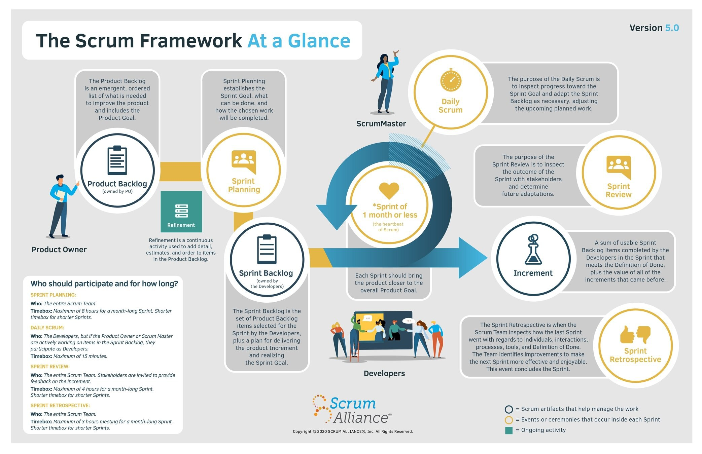

### Роли:

- Product Owner — отвечает за то, что разрабатывать.

- Scrum Master — следит за соблюдением Scrum-процессов, устраняет препятствия.

- Команда разработчиков — сама организует свою работ

### Артефакты:

- Product Backlog — список всех задач/требований к продукту.

- Sprint Backlog — задачи, выбранные на текущий спринт.

- Инкремент — рабочая версия продукта по итогам спринта.

### Процесс:

- Планирование спринта.

- Ежедневные короткие встречи (Daily Stand-ups).

- Демонстрация результата (Sprint Review).

- Обсуждение улучшений (Retrospective).

## Kanban
метод управления задачами, который помогает визуализировать процесс, выявлять узкие места и улучшать поток работы

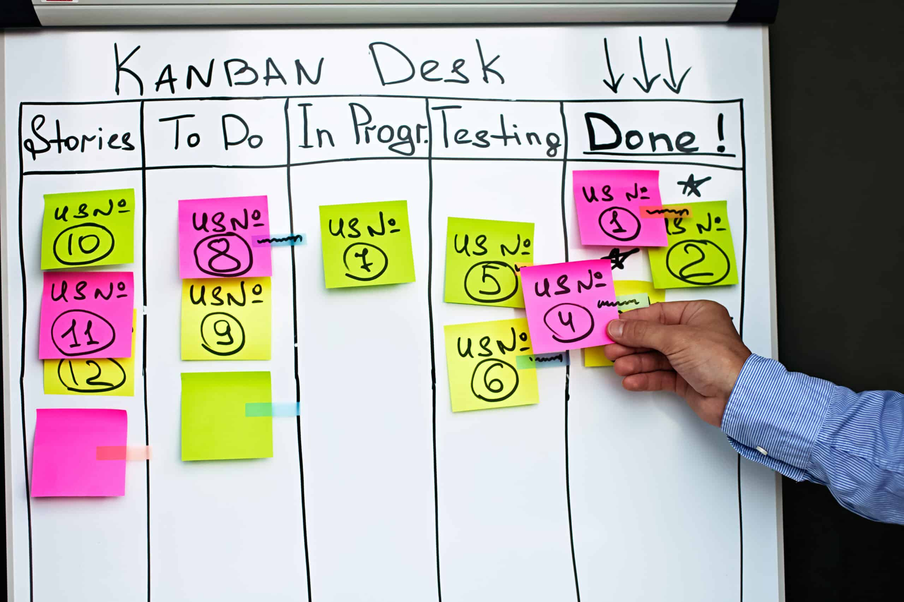

### Основная идея:
- Задачи проходят через стадии, обычно это:
To Do → In Progress → Done

- Всё отображается на Kanban-доске — физической или цифровой.

- Главное — ограничить количество задач в работе одновременно (WIP – Work In Progress), чтобы команда не перегружалась и завершала начатое.

### Принципы:
- Начни с того, что есть — не нужно радикально менять процесс.

- Ограничь WIP — меньше задач в работе = больше фокуса и качества.

- Измеряй и улучшай — следи за временем выполнения задач и оптимизируй процесс.

## Scrumban
Гибкий подход, который сочетает в себе:

- структуру и ритм Scrum (спринты, ежедневные встречи, роли),

- визуализацию и непрерывный поток задач из Kanban (доска, WIP-лимиты, непрерывная работа без "жестких" спринтов).

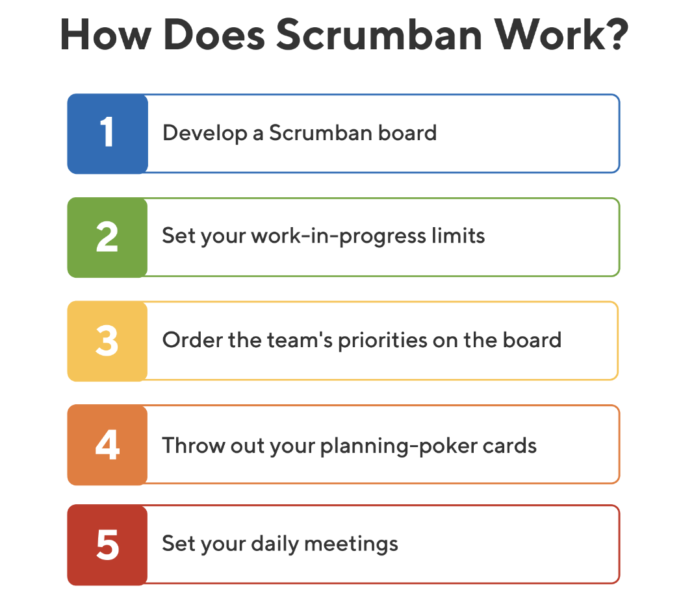

### Основные особенности

<small>

| **Элемент**                         | **Из Scrum**                   | **Из Kanban**                       |
|------------------------------------|--------------------------------|-------------------------------------|
| Планирование задач                 | ✅ Спринты (иногда)             | ✅ Непрерывное добавление задач     |
| Визуализация                       | 🔸 Иногда                       | ✅ Kanban-доска                     |
| Ограничение задач в работе (WIP)  | ❌                              | ✅                                   |
| Роли (Scrum Master, Product Owner)| ✅                              | ❌                                   |
| Постоянное улучшение              | ✅ Retrospective                | ✅ Анализ потока                     |

</small>

### Project Estimation Techniques

Это методы оценки времени, ресурсов и затрат, которые потребуются для выполнения проекта.

## Project Estimation Techniques

<table style="font-size: 0.6em; width: 100%; border-collapse: collapse;">
  <thead>
    <tr>
      <th style="text-align: left; padding: 0.4em; border-bottom: 2px solid #ccc;">📌 <strong>Метод</strong></th>
      <th style="text-align: left; padding: 0.4em; border-bottom: 2px solid #ccc;"><strong>Описание</strong></th>
    </tr>
  </thead>
  <tbody>
    <tr>
      <td style="padding: 0.4em; vertical-align: top;"><strong>Expert Judgment</strong></td>
      <td style="padding: 0.4em;">Оценка на основе мнения опытных специалистов</td>
    </tr>
    <tr>
      <td style="padding: 0.4em; vertical-align: top;"><strong>Analogous Estimating</strong></td>
      <td style="padding: 0.4em;">Использование данных прошлых похожих проектов</td>
    </tr>
    <tr>
      <td style="padding: 0.4em; vertical-align: top;"><strong>Parametric Estimating</strong></td>
      <td style="padding: 0.4em;">Математическая формула: метрика × объём работы</td>
    </tr>
    <tr>
      <td style="padding: 0.4em; vertical-align: top;"><strong>Three-Point Estimation</strong></td>
      <td style="padding: 0.4em;">Формула: (О + 4Н + П) / 6 <em>(Optimistic + 4 × Normal + Pessimistic) / 6</em></td>
    </tr>
    <tr>
      <td style="padding: 0.4em; vertical-align: top;"><strong>Planning Poker</strong></td>
      <td style="padding: 0.4em;">Командное обсуждение оценок задач с картами и консенсусом</td>
    </tr>
  </tbody>
</table>

### Planning Poker
Способ коллективно и анонимно оценить сложность или объём задачи(Story points) с помощью специальных карточек с числами(обычно из последовательности Фибоначчи: 1, 2, 3, 5, 8, 13, 21…). Цель — прийти к общему пониманию и консенсусу в команде.

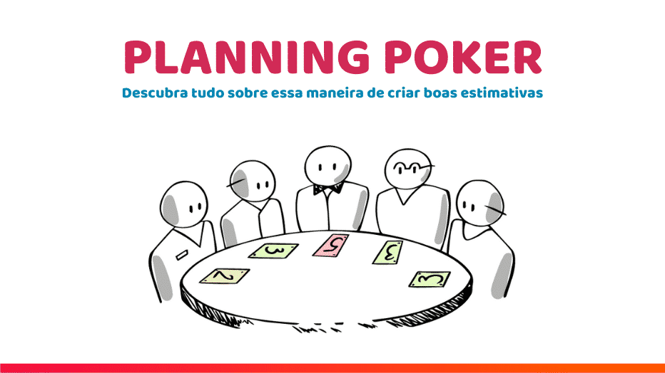

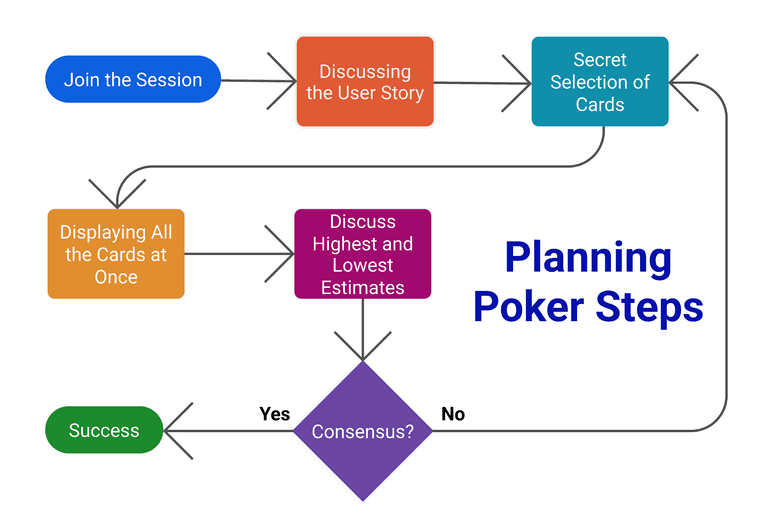

### DevOps
Подход, основанный на сотрудничестве между разработчиками(Dev) и операторами(Ops), направленный на автоматизацию процессов, повышение скорости доставки и улучшение качества продукта. Основная цель DevOps — сократить цикл разработки и снизить количество ошибок, а также ускорить внедрение изменений в рабочие системы.

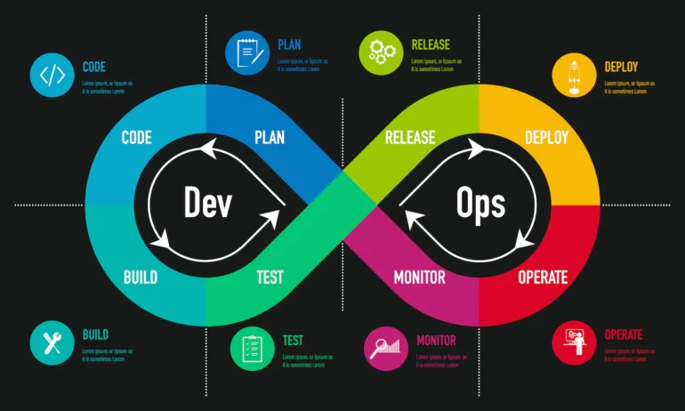

#### ключевые принципы:

<section style="font-size:0.6em" >

| 🧩 **Принцип**                     | **Описание**                                                                 |
|-----------------------------------|--------------------------------------------------------------------------------------|
| **Collaboration**                 | Сотрудничество Dev & Ops на всех этапах — от идеи до релиза                         |
| **Automation**                    | Автоматизация сборки, тестов и деплоя — всё для скорости и стабильности             |
| **Continuous Improvement**        | Непрерывная оптимизация процессов и качества (CI/CD) разработки                              |
| **Customer-Centric Action**       | Быстрая реакция на фидбек пользователей и ориентация на их потребности              |
| **Create with the End in Mind**   | Создание продукта с чётким пониманием его цели и пользы для конечного пользователя  |

<section>

В Agile-процессах важно **вести учёт задач, сроков и прогресса** команды.
Это помогает отслеживать загрузку, фокусироваться на приоритетах и проводить ретроспективы.

---

### Популярные инструменты:

- **Jira** — продвинутый инструмент для Scrum/Kanban-досок, бэклога и спринтов
- **Trello** — простой kanban-доска, удобно для небольших команд
- **YouTrack**, **ClickUp**, **Asana** — альтернативы в зависимости от нужд
- **GitHub Projects** — отлично сочетается с репозиториями

---

### Что отслеживаем:

- Story points и статус задач
- Назначенные исполнители
- Прогресс по спринтам
- Историю изменений

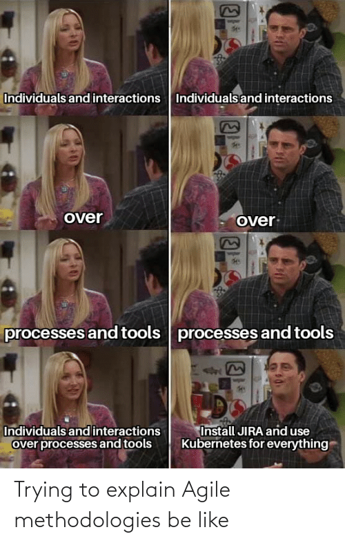

## 💚 Thank You! 💚

Готова ответить на вопросы

[@dzichonka](https://github.com/dzichonka)

---

Презентация создана с использованием <strong>reveal.js</strong> и Markdown

