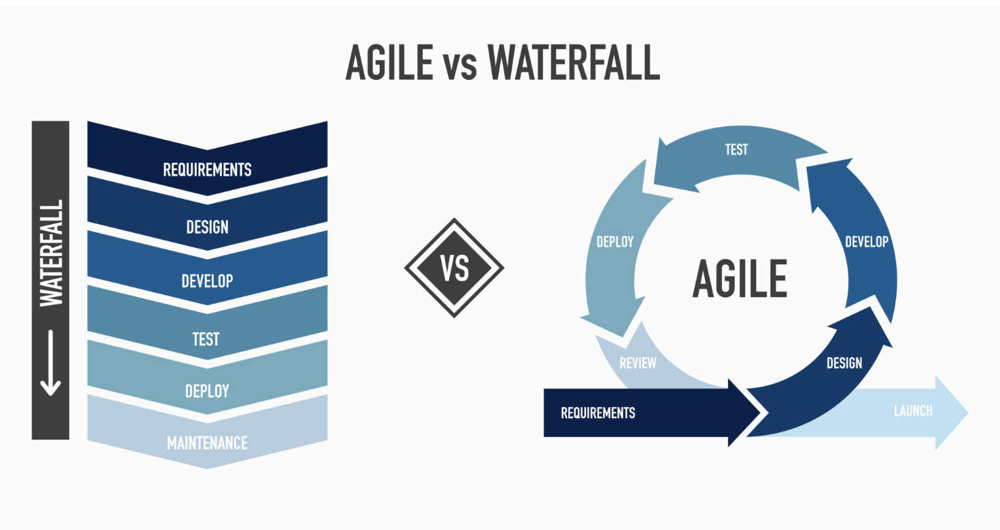
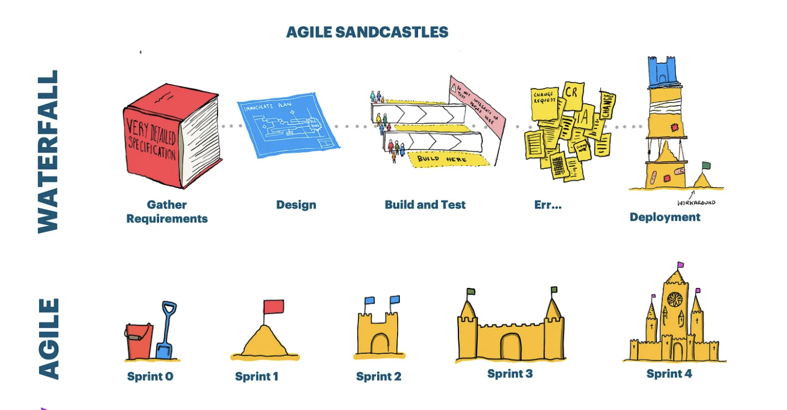
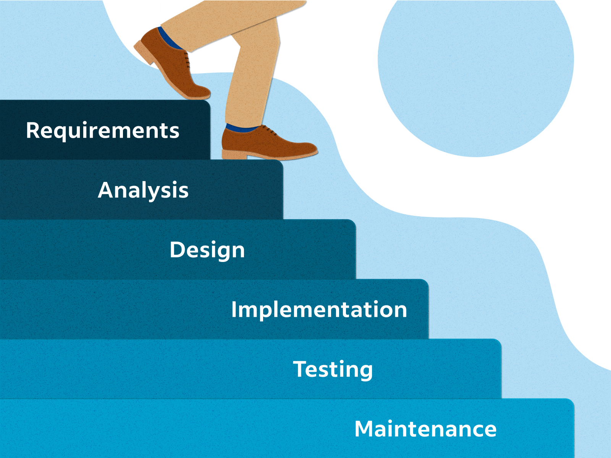
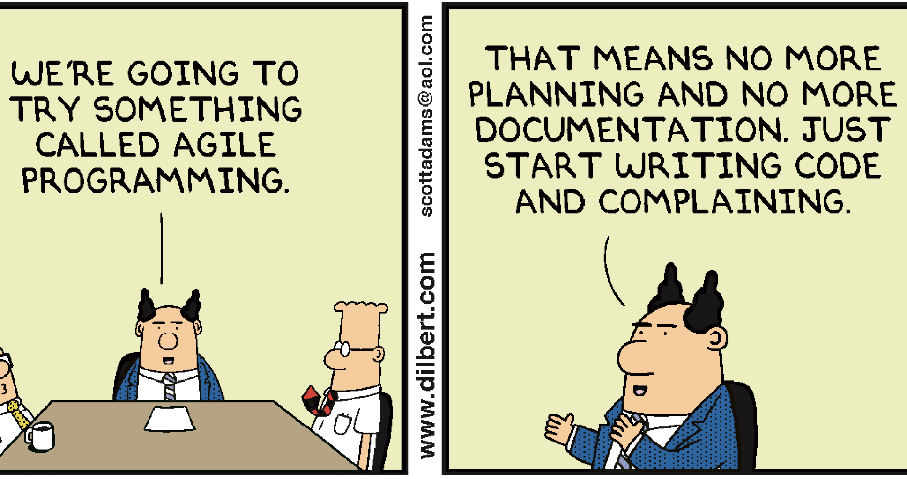
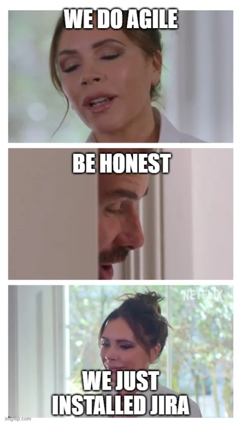
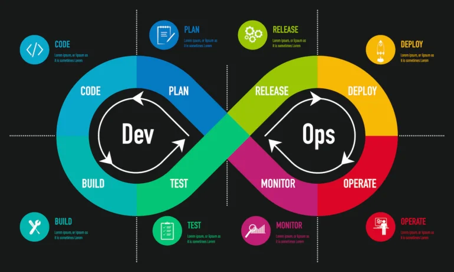

# Software Development Methodologies

##### 📚 Topics Covered

- 🌀 Agile <!-- .element: class="fragment" data-fragment-index="1" -->
- 🧭 Scrum <!-- .element: class="fragment" data-fragment-index="2" -->
- 📋 Kanban <!-- .element: class="fragment" data-fragment-index="2" -->
- 🧱 Waterfall
- 🃏 Planning Poker <!-- .element: class="fragment" data-fragment-index="3" -->
- 📏 Story Points <!-- .element: class="fragment" data-fragment-index="3" -->
- ⚙️ DevOps <!-- .element: class="fragment" data-fragment-index="3" -->
- 🔢 Three-Point Estimation <!-- .element: class="fragment" data-fragment-index="4" -->
- 🧠 Expert Judgment <!-- .element: class="fragment" data-fragment-index="4" -->
- ✨ ... <!-- .element: class="fragment" data-fragment-index="5" -->

## 🤔 Methodology?

It’s the **answer to the question**:
“How exactly are we going to get this done — together?”

## 🧱 Traditional Models

### 💧 Waterfall

- 📋 Work is done **step by step**, strictly following the plan
- 🚫 No intermediate results until the **very end**

<small>

✅ **Best suited when:**

- 🔐 Requirements are **clear and fixed**
- 📅 Deadlines, 📑 documentation, and 🏛 standards must be strictly followed
- 🏗 Like building a house: foundation first, then walls, then roof

</small>

### Flexible Models

**(Agile)**

- The project is broken down into small parts — tasks, sprints, increments.

- Each part results in a working product that can be tested and shown to the client.

## Waterfall

<small>

- Sequential phases: Analysis → Design → Implementation → Testing → Deployment → Maintenance.
- Each stage must be completed before the next begins.
- Changes after the start are difficult and expensive.
- Suitable for projects with clear, stable requirements..

</small>

<small>Design → Implementation → Testing → Deployment → Maintenance</small>

## Agile Manifesto

| More important                   | Less important              |
| -------------------------------- | --------------------------- |
| **Individuals and interactions** | Processes and tools         |
| **Working software**             | Comprehensive documentation |
| **Customer collaboration**       | Contract negotiation        |
| **Responding to change**         | Following a plan            |

We value the items on the right, but we value the items on the left more.

##### Agile

<small>
A mindset that helps teams deliver value in uncertain conditions. It’s not a template, but a collaborative approach.
</small>

- We accept that the final result is not fixed.

- We don’t just allow the client to intervene — we make it comfortable for them to do so.

- We try our best not to turn the project into chaos — even if it goes off-plan.

## Scrum

<small>

One of the Agile frameworks.

Work is divided into sprints (usually 2 weeks).

Roles: Scrum Master, Product Owner, Team.

Artifacts: Product Backlog, Sprint Backlog, Increment.

Daily standups, retrospectives, sprint planning.

</small>

### Roles:

- Product Owner — defines what to build.

- Scrum Master — ensures Scrum is followed, removes obstacles.

- Development Team — self-organizes and does the work.

### Artifacts:

- Product Backlog — full list of product requirements and tasks.

- Sprint Backlog — selected tasks for the current sprint.

- Increment — working product delivered at the end of the sprint.

### Process

- Sprint planning

- Daily stand-up meetings

- Sprint review (demo)

- Retrospective (what to improve)

## ⭐ Scrum Values

Scrum is not only about sprints and standups — it’s also built on **five core values** that guide the team’s behavior and collaboration.

| 💡 **Value**     | 🧭 **Meaning**                                                                 |
|------------------|---------------------------------------------------------------------------------|
| **Commitment**   | The team commits to achieving goals and supporting each other                   |
| **Focus**        | Everyone focuses on the work of the Sprint and the goals of the Scrum Team      |
| **Openness**     | The team is open about work, challenges, and progress                           |
| **Respect**      | Team members respect each other as capable and independent professionals        |
| **Courage**      | Team members have the courage to do the right thing and face tough problems     |

## Kanban

A task management method that helps visualize the process, identify bottlenecks, and improve workflow.

### Core Idea

- Tasks go through stages, typically:

- To Do → In Progress → Done

- Everything is shown on a Kanban board — physical or digital.

- The key is to limit the number of tasks in progress (WIP — Work In Progress), so the team stays focused and finishes what they started.

### Principles

- Start with what you have — no need for radical changes.

- Limit WIP — fewer tasks = more focus and quality.

- Measure and improve — track cycle time and optimize the process.

## 🧮 What are Story Points?

**Story Points** are a way to measure the **relative effort** needed to complete a task.
They are not hours — instead, they reflect:

- ⏳ **Time**
- 🧠 **Complexity**
- 🎲 **Uncertainty or risk**

### 📌 Why use Story Points?

- 🔢 Help teams **compare tasks** (e.g., Task A is twice as hard as Task B)
- 🚀 Support **prioritization** and planning
- 📊 Allow tracking of **throughput** — how many points are completed over time

Story Points are often chosen from the **Fibonacci sequence**:
`1, 2, 3, 5, 8, 13, 21...`
Each number reflects growing uncertainty with larger tasks.

## Scrumban

A hybrid approach that combines:

- the structure and rhythm of Scrum (sprints, stand-ups, roles),

- the visualization and continuous task flow of Kanban (board, WIP limits, no rigid sprints).

### Project Estimation Techniques

These are methods for estimating time, resources, and costs required for a project.

<table style="font-size: 0.6em; width: 100%; border-collapse: collapse;">
  <thead>
    <tr>
      <th style="text-align: left; padding: 0.4em; border-bottom: 2px solid #ccc;">📌 <strong>Method</strong></th>
      <th style="text-align: left; padding: 0.4em; border-bottom: 2px solid #ccc;"><strong>Description</strong></th>
    </tr>
  </thead>
  <tbody>
    <tr>
      <td style="padding: 0.4em; vertical-align: top;"><strong>Expert Judgment</strong></td>
      <td style="padding: 0.4em;">Estimation based on the opinion of experienced professionals</td>
    </tr>
    <tr>
      <td style="padding: 0.4em; vertical-align: top;"><strong>Analogous Estimating</strong></td>
      <td style="padding: 0.4em;">Using data from similar past projects</td>
    </tr>
    <tr>
      <td style="padding: 0.4em; vertical-align: top;"><strong>Parametric Estimating</strong></td>
      <td style="padding: 0.4em;">Mathematical formula: metric × amount of work</td>
    </tr>
    <tr>
      <td style="padding: 0.4em; vertical-align: top;"><strong>Three-Point Estimation</strong></td>
      <td style="padding: 0.4em;">Formula: (O + 4N + P) / 6 <em>(Optimistic + 4 × Normal + Pessimistic) / 6</em></td>
    </tr>
    <tr>
      <td style="padding: 0.4em; vertical-align: top;"><strong>Planning Poker</strong></td>
      <td style="padding: 0.4em;">Team discussion and voting on task estimates using cards, reaching consensus</td>
    </tr>
  </tbody>
</table>

### Planning Poker

A collaborative and anonymous method for estimating task complexity or size (Story Points) using numbered cards.
The goal is to reach a shared understanding and agreement within the team.

### DevOps

An approach based on collaboration between developers (Dev) and operations (Ops), focused on automating processes, accelerating delivery, and improving product quality.
The main goal of DevOps is to shorten the development cycle, reduce errors, and speed up the deployment of changes into production.

#### Key Principles:

<section style="font-size:0.6em" >

| 🧩 **Principle**                | **Description**                                                     |
| ------------------------------- | ------------------------------------------------------------------- |
| **Collaboration**               | Dev & Ops work together across all stages — from idea to release    |
| **Automation**                  | Automating builds, tests, and deployments — for speed and stability |
| **Continuous Improvement**      | Ongoing optimization of processes and quality (CI/CD practices)     |
| **Customer-Centric Action**     | Fast response to user feedback and focus on real customer needs     |
| **Create with the End in Mind** | Building products with clear goals and end-user value in mind       |

</section>

## Project Estimation Techniques

In Agile processes, it's important to **track tasks, deadlines, and team progress**.
This helps monitor workload, focus on priorities, and run effective retrospectives.

### Popular tools:

- **Jira** — a powerful tool for Scrum/Kanban boards, backlogs, and sprints
- **Trello** — a simple Kanban board, great for small teams
- **YouTrack**, **ClickUp**, **Asana** — alternatives depending on team needs
- **GitHub Projects** — integrates well with code repositories

### What we track:

- Story points and task status
- Assigned team members
- Sprint progress
- Change history

## 💚 Thank You! 💚

[@dzichonka](https://github.com/dzichonka)

Done with reveal.js, Markdown and <strong>love</strong>

