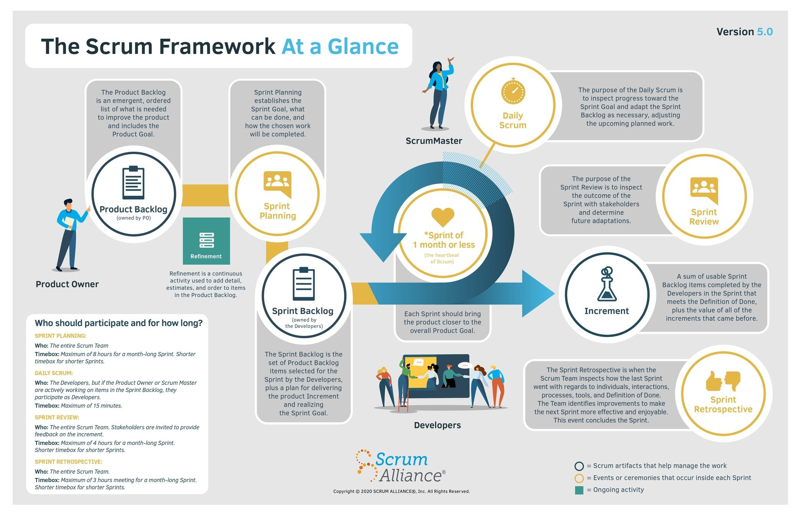
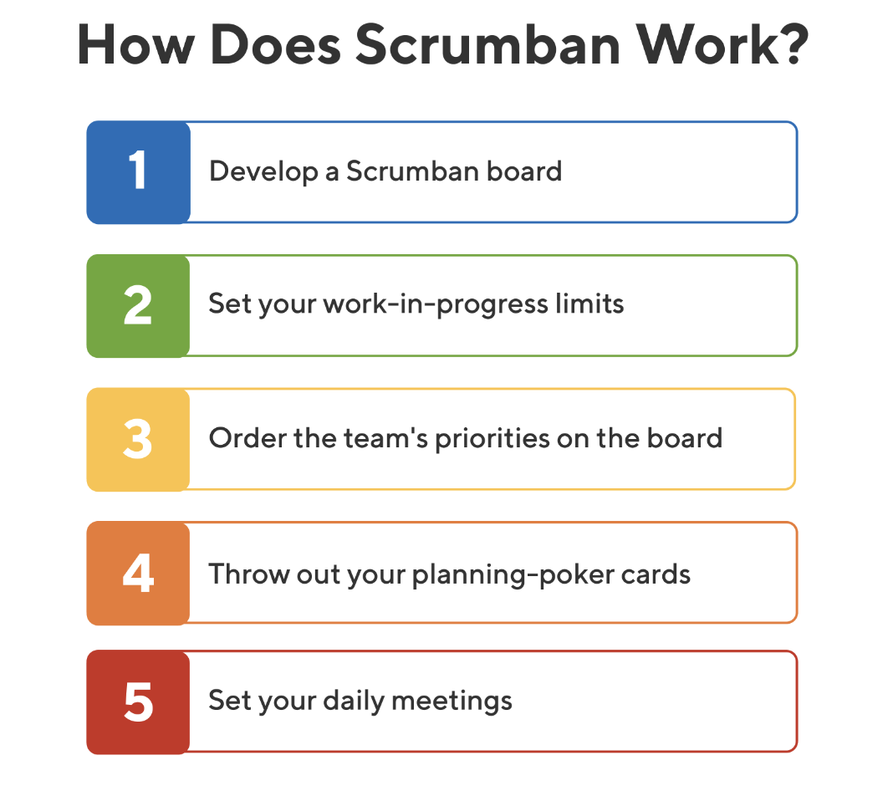
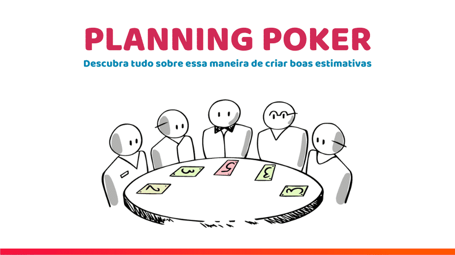
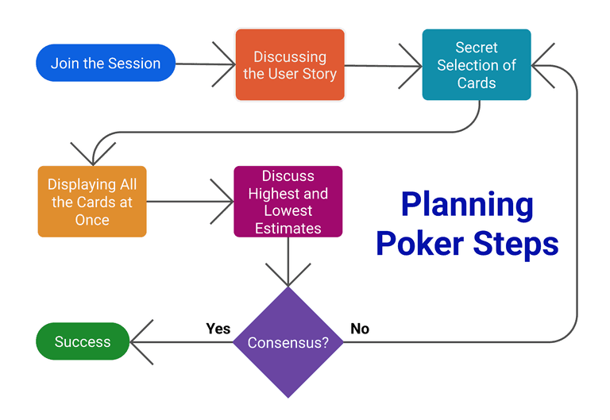

# Software Development Methodologies

Note:
Hi everyone!
Today I want to talk about software development methodologies.

##### 📚 Topics Covered

- 🌀 Agile <!-- .element: class="fragment" data-fragment-index="1" -->
- 🧭 Scrum <!-- .element: class="fragment" data-fragment-index="2" -->
- 📋 Kanban <!-- .element: class="fragment" data-fragment-index="2" -->
- 🧱 Waterfall
- 🃏 Planning Poker <!-- .element: class="fragment" data-fragment-index="3" -->
- 📏 Story Points <!-- .element: class="fragment" data-fragment-index="3" -->
- ⚙️ DevOps <!-- .element: class="fragment" data-fragment-index="3" -->
- 🔢 Three-Point Estimation <!-- .element: class="fragment" data-fragment-index="4" -->
- 🧠 Expert Judgment <!-- .element: class="fragment" data-fragment-index="4" -->
- ✨ ... <!-- .element: class="fragment" data-fragment-index="5" -->

Note:
We’ll go through different approaches like Agile, Scrum, Kanban, and Waterfall,
plus some helpful techniques like Planning Poker, Story Points, and even DevOps.

Let’s go! 🚀

## 🤔 Methodology?

It’s the **answer to the question**:
“How exactly are we going to get this done — together?”

Note:
So… what is a methodology?

It’s basically the answer to:
👉 “How do we work together to get this project done?”

It gives the team structure, tools, and a plan — like a map for the journey.

## 🧱 Traditional Models

- 📋 Work is done **step by step**, strictly following the plan
- 🚫 No intermediate results until the **very end**

<small>

✅ **Best suited when:**

- 🔐 Requirements are **clear and fixed**
- 📅 Deadlines, 📑 documentation, and 🏛 standards must be strictly followed
- 🏗 Like building a house: foundation first, then walls, then roof

</small>

Note:
Let’s start with the traditional way of doing projects.

In the traditional approach, you plan everything up front.
You know exactly what you want at the start. 📝

You move through fixed stages:
requirements → design → implementation → testing → delivery.

There’s no turning back! 😅
If something changes — it’s very hard (and expensive) to fix later.

### Flexible Models

- The project is broken down into small parts — tasks, sprints, increments.

- Each part results in a working product that can be tested and shown to the client.

Note:
Now let’s look at the flexible approach.

Imagine you are doing home renovation. 🛠️🏡
You don’t wait 6 months to see if the whole apartment looks good.
Instead, you renovate one room at a time:

paint the walls 🎨,

fix the lights 💡,

choose the furniture 🛋️.

You finish a small part, check it, show it to your family —
and if needed, make changes right away!

Agile works the same way:

In each small cycle, the team goes through all stages — analysis, design, coding, testing, delivery.

Each cycle gives a working result and a chance to adjust.

This way, you avoid big disasters and keep moving forward fast and safely. 🚀

Note: Here you can see another important difference.

On the left — in the traditional approach,
we go through each stage only once:
analysis, design, implementation, testing, and delivery.
Step by step — no going back. 🛤️

On the right — in the Agile approach,
we go through all these stages again and again in small cycles. 🔁
In every iteration, we analyze, design, build, test, and deliver a working piece.

It’s like making a cake layer by layer 🎂 instead of baking the whole wedding cake at once!
You can taste it earlier — and fix it if it’s too salty 😄

Note: In this picture, you can clearly see the difference.

On the left — the traditional model:
Everything is planned from the start. You only see the final product at the very end.
It's like ordering a house and seeing it only after 6 months — surprise! 🏠😅

On the right — the flexible model (Agile):
You build and improve step by step. You can see progress early, give feedback, and make changes.
Like doing home renovation room by room — you can fix things faster and avoid big disasters! 🛠️

## Waterfall

<small>

- Sequential phases: Analysis → Design → Implementation → Testing → Deployment → Maintenance.
- Each stage must be completed before the next begins.
- Changes after the start are difficult and expensive.
- Suitable for projects with clear, stable requirements..

</small>

Note: The most famous traditional model is Waterfall.

It’s like building a house 🏠:

First the foundation,

then the walls,

then the roof.
Step by step, in order.

<small>Design → Implementation → Testing → Deployment → Maintenance</small>

Note: You don't move to the next step until the current one is finished.
And you don’t see the final result until the very end! 🚪

Waterfall is great when the requirements are clear and stable —
for example, in government or big industrial projects.

But it’s not very flexible for changing needs.

## Agile Manifesto

| More important                   | Less important              |
| -------------------------------- | --------------------------- |
| **Individuals and interactions** | Processes and tools         |
| **Working software**             | Comprehensive documentation |
| **Customer collaboration**       | Contract negotiation        |
| **Responding to change**         | Following a plan            |

We value the items on the right, but we value the items on the left more.

Note:
In 2001, a group of 17 software developers met in a ski resort in Utah, USA. 🎿🏔️

They were tired of slow and heavy development processes.
So they sat together and asked:
👉 "How can we build software better and faster?"

That’s how the Agile Manifesto was born — a new way of thinking about projects.

It says that we value:

People and interactions more than just processes and tools 🤝

Working software more than perfect documentation 🖥️

Customer collaboration more than contract negotiation 🤝📝

Responding to change more than following a strict plan 🔄

Of course, the things on the right are still important —
but the things on the left are even more important to create great products!

Note:
Some people joke that Agile means:

"No planning, no documentation — just code fast and complain later!" 😅

But that's not true!

##### Agile

<small>
A mindset that helps teams deliver value in uncertain conditions. It’s not a template, but a collaborative approach.
</small>

- We accept that the final result is not fixed.

- We don’t just allow the client to intervene — we make it comfortable for them to do so.

- We try our best not to turn the project into chaos — even if it goes off-plan.

Note:

Agile is not chaos —
It’s about being smart and flexible,
planning just enough to move forward,
and adapting quickly when things change.

Note: Another funny meme says:

"We are doing Agile...
because we installed Jira!" 😄

But real Agile is not about tools.
It’s about changing how people think and work together —
not just clicking tasks in a new app!

## Scrum

<small>

One of the Agile frameworks.

Work is divided into sprints (usually 2 weeks).

Roles: Scrum Master, Product Owner, Team.

Artifacts: Product Backlog, Sprint Backlog, Increment.

Daily standups, retrospectives, sprint planning.

</small>

Note:
Now let’s look at Scrum — one of the most popular Agile frameworks.

Note:
You work in short sprints, usually 2 weeks.
You have 3 roles:

Product Owner: decides what should be built

Scrum Master: helps the team stay focused and removes blockers

Team: self-organizes and does the work

There are also useful tools:

Product Backlog

Sprint Backlog

And at the end — an Increment: a working piece of the product

### Roles:

- Product Owner — defines what to build.

- Scrum Master — ensures Scrum is followed, removes obstacles.

- Development Team — self-organizes and does the work.

### Artifacts:

- Product Backlog — full list of product requirements and tasks.

- Sprint Backlog — selected tasks for the current sprint.

- Increment — working product delivered at the end of the sprint.

### Process

- Sprint planning

- Daily stand-up meetings

- Sprint review (demo)

- Retrospective (what to improve)

Note: Here’s what a Scrum cycle looks like:

We plan the sprint

Have daily standups

Show results at the end

And then reflect: what went well, what can improve?

Simple, but powerful.

## ⭐ Scrum Values

Scrum is not only about sprints and standups — it’s also built on **five core values** that guide the team’s behavior and collaboration.

| 💡 **Value**     | 🧭 **Meaning**                                                                 |
|------------------|---------------------------------------------------------------------------------|
| **Commitment**   | The team commits to achieving goals and supporting each other                   |
| **Focus**        | Everyone focuses on the work of the Sprint and the goals of the Scrum Team      |
| **Openness**     | The team is open about work, challenges, and progress                           |
| **Respect**      | Team members respect each other as capable and independent professionals        |
| **Courage**      | Team members have the courage to do the right thing and face tough problems     |

Note: Scrum isn’t only about meetings — it’s about values:

Commitment: we do what we promised

Focus: no distractions

Openness: we’re honest about progress

Respect: we trust each other

Courage: to try, to fail, and to improve

These values help the team stay strong and connected.

## Kanban

A task management method that helps visualize the process, identify bottlenecks, and improve workflow.

Note: Kanban is another flexible method — more visual and continuous.

Note:
Tasks move through stages:
📋 To Do → 🔄 In Progress → ✅ Done

Everything is on a board — physical or digital.
The key idea is: don’t start too much at once.
That way, you finish faster and better.

It’s great for support teams or any workflow that’s always changing.al.

## 🧩 Kanban Principles

- 🏁 **Start with what you have** — no need for big changes at the beginning.
- 🚦 **Limit work in progress (WIP)** — fewer tasks = more focus and better quality.
- 📈 **Measure and improve** — track how long tasks take and keep optimizing the flow.

Note: When starting with Kanban, you don’t need to throw everything away and rebuild your process.

🏁 First, start with what you have.
Look at your current workflow — and just visualize it on a board.

🚦 Then, limit WIP — how many tasks are "in progress" at the same time.
Less is more: fewer tasks mean more attention, faster results, and better quality.

📈 Finally, measure and improve.
Watch how long tasks take — and find ways to work smarter, not harder.

Kanban is about evolution, not revolution. 🔄

## 🧮 What are Story Points?

**Story Points** are a way to measure the **relative effort** needed to complete a task.
They are not hours — instead, they reflect:

- ⏳ **Time**
- 🧠 **Complexity**
- 🎲 **Uncertainty or risk**

Note: Let’s talk about a key Agile concept: Story Points.

Story Points don’t measure time — they measure effort.

### 📌 Why use Story Points?

- 🔢 Help teams **compare tasks** (e.g., Task A is twice as hard as Task B)
- 🚀 Support **prioritization** and planning
- 📊 Allow tracking of **throughput** — how many points are completed over time

Story Points are often chosen from the **Fibonacci sequence**:
`1, 2, 3, 5, 8, 13, 21...`
Each number reflects growing uncertainty with larger tasks.

Note:
We ask: how big or hard is this task?
We think about time ⏳, complexity 🧠, and uncertainty 🎲

We usually use the Fibonacci scale: 1, 2, 3, 5, 8, 13…

It helps compare tasks, prioritize, and track progress.
Task A might be twice as big as Task B — that’s useful to know!

## Scrumban

A hybrid approach that combines:

- the structure and rhythm of Scrum (sprints, stand-ups, roles),

- the visualization and continuous task flow of Kanban (board, WIP limits, no rigid sprints).

Note: Can’t choose between Scrum and Kanban?
Use both! 😄

Note:
Scrumban combines:

Structure from Scrum (like roles and planning)

Flow from Kanban (no strict sprints, just smooth progress)

Best of both worlds!

### Project Estimation Techniques

These are methods for estimating time, resources, and costs required for a project.

<table style="font-size: 0.6em; width: 100%; border-collapse: collapse;">
  <thead>
    <tr>
      <th style="text-align: left; padding: 0.4em; border-bottom: 2px solid #ccc;">📌 <strong>Method</strong></th>
      <th style="text-align: left; padding: 0.4em; border-bottom: 2px solid #ccc;"><strong>Description</strong></th>
    </tr>
  </thead>
  <tbody>
    <tr>
      <td style="padding: 0.4em; vertical-align: top;"><strong>Expert Judgment</strong></td>
      <td style="padding: 0.4em;">Estimation based on the opinion of experienced professionals</td>
    </tr>
    <tr>
      <td style="padding: 0.4em; vertical-align: top;"><strong>Analogous Estimating</strong></td>
      <td style="padding: 0.4em;">Using data from similar past projects</td>
    </tr>
    <tr>
      <td style="padding: 0.4em; vertical-align: top;"><strong>Parametric Estimating</strong></td>
      <td style="padding: 0.4em;">Mathematical formula: metric × amount of work</td>
    </tr>
    <tr>
      <td style="padding: 0.4em; vertical-align: top;"><strong>Three-Point Estimation</strong></td>
      <td style="padding: 0.4em;">Formula: (O + 4N + P) / 6 <em>(Optimistic + 4 × Normal + Pessimistic) / 6</em></td>
    </tr>
    <tr>
      <td style="padding: 0.4em; vertical-align: top;"><strong>Planning Poker</strong></td>
      <td style="padding: 0.4em;">Team discussion and voting on task estimates using cards, reaching consensus</td>
    </tr>
  </tbody>
</table>

Note: Let’s now look at how teams estimate effort.

We use different techniques:

🧠 Expert Judgment — ask someone experienced

📊 Analogous Estimating — use past project data

🔢 Parametric Estimating — use a formula: time × number of items

🎯 Three-Point Estimation — average of best case, normal case, and worst case

🃏 Planning Poker — we’ll talk about that next!

### Planning Poker

A collaborative and anonymous method for estimating task complexity or size (Story Points) using numbered cards.
The goal is to reach a shared understanding and agreement within the team.

Note: Planning Poker is a fun way to estimate tasks as a team.

Note: Each person picks a card with a number (story points)
We reveal all cards at once — and talk about differences.

It’s anonymous and democratic — even quiet team members can share their views.

And yes, it’s way more fun than Excel! 😄

### DevOps

An approach based on collaboration between developers (Dev) and operations (Ops), focused on automating processes, accelerating delivery, and improving product quality.
The main goal of DevOps is to shorten the development cycle, reduce errors, and speed up the deployment of changes into production.

Note: Now let’s talk about DevOps.

It’s a culture where developers and operations work together
— not like two separate teams, but one big team.

They build, test, deploy, and monitor the product together.

The goal is simple:
🚀 deliver faster, with fewer bugs, and more confidence.

#### Key Principles:

<section style="font-size:0.6em" >

| 🧩 **Principle**                | **Description**                                                     |
| ------------------------------- | ------------------------------------------------------------------- |
| **Collaboration**               | Dev & Ops work together across all stages — from idea to release    |
| **Automation**                  | Automating builds, tests, and deployments — for speed and stability |
| **Continuous Improvement**      | Ongoing optimization of processes and quality (CI/CD practices)     |
| **Customer-Centric Action**     | Fast response to user feedback and focus on real customer needs     |
| **Create with the End in Mind** | Building products with clear goals and end-user value in mind       |

</section>

Note: Here are the main DevOps principles:

Collaboration — break the wall between Dev and Ops

Automation — don’t do the same boring thing twice

Continuous Improvement — test, learn, improve

Customer Focus — deliver what people really want

Build with purpose — understand why the product exists

## Project Estimation Techniques

In Agile processes, it's important to **track tasks, deadlines, and team progress**.
This helps monitor workload, focus on priorities, and run effective retrospectives.

Note: To make all this work, we need to track what we’re doing.

### Popular tools:

- **Jira** — a powerful tool for Scrum/Kanban boards, backlogs, and sprints
- **Trello** — a simple Kanban board, great for small teams
- **YouTrack**, **ClickUp**, **Asana** — alternatives depending on team needs
- **GitHub Projects** — integrates well with code repositories

### What we track:

- Story points and task status
- Assigned team members
- Sprint progress
- Change history

Note: 💬 But remember:
**Tools are just tools.**
They help, but they don't create Agile by themselves.
Don’t forget the real Agile values from the Manifesto! 💚

Without good teamwork and communication —
even the best tool will not save the project. 😅

## 💚 Thank You! 💚

[@dzichonka](https://github.com/dzichonka)

Done with reveal.js, Markdown and <strong>love</strong>

Note: That’s it! Thanks so much for watching. 🎬

If you have any questions or ideas — feel free to reach out!
I’ll be happy to connect and discuss more.

All my contacts are in the description below. 👇
Let’s keep in touch!
